API
===

Organization Units
******************

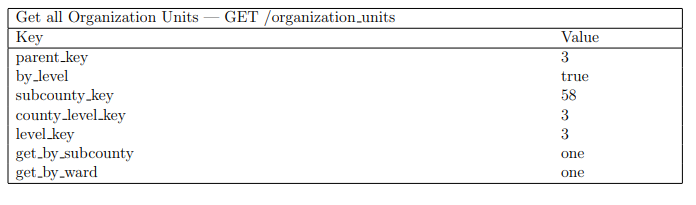

Indicators
**********
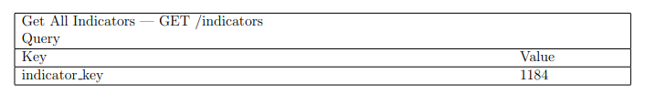

Indicator Facts
***************
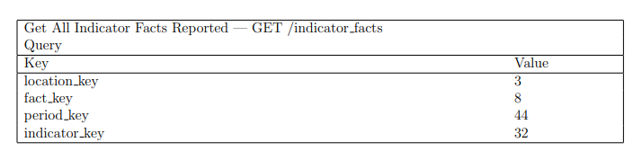

Indicator Facts Reported Statistics
***********************************
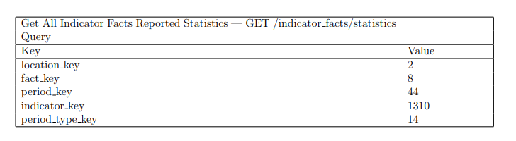

Indicator Filter Period Types
*****************************
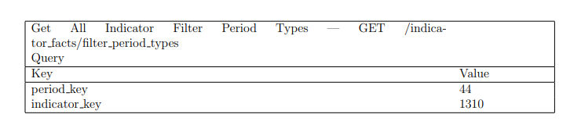

Indicator Filter Periods
************************
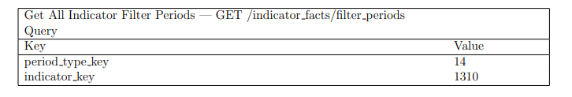

Indicator Filter Disaggregations
********************************
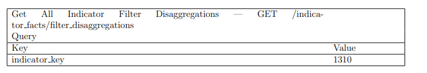

Time Periods
************
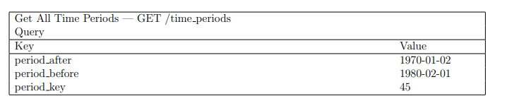

Knowledge Pipelines
*******************
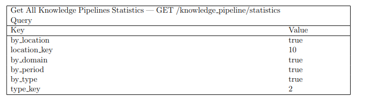

Commodities
***********
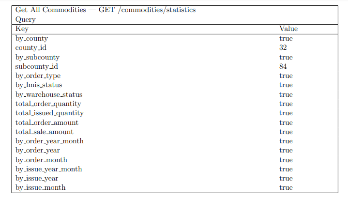

 Indicator Groups
*****************
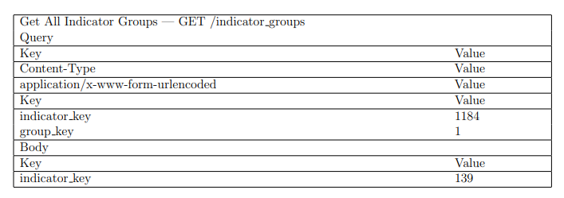

Facility Listings
*****************
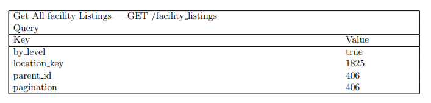

Facility Listings Statistics
****************************
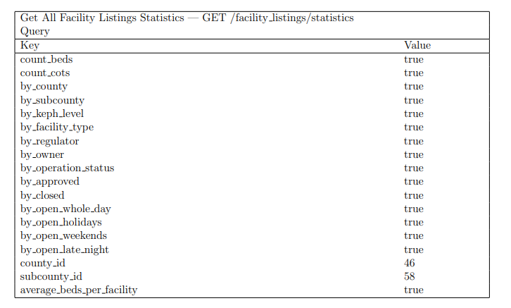

Extracting data from KHIS to KHRO Microservice
**********************************************
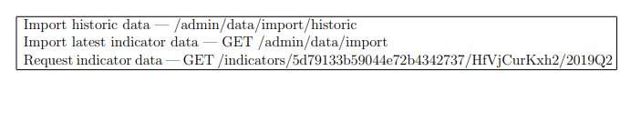

