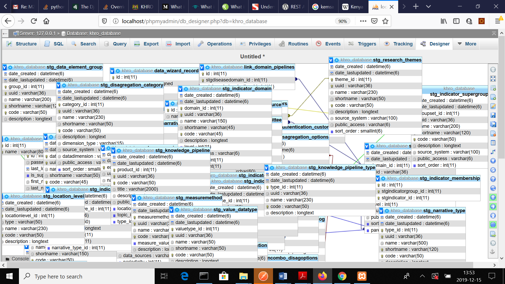

Development Standards
=====================

General programming
*******************

All indices should zero based. e.g. if a ¡select¿ element has sequential numeric values these
would be from the series 0,1,2,3.

Database
********

**Naming**

* table names, column names: all lowercase, use underscores to separate words e.g **e.g permission role
**
* names with abbreviations may be treated differently e.g. **targetTAT** makes more sense
* better long names that makes sense

#. Use of appropriate field type e.g. ‘**SMALLINT**’ instead of ‘**STRING**’ for age
#. If a primary key is necessary on a table it should be the first column and should be named 'id'. It should be unsigned.
#. When this id is referenced in another table (as a foreign key) it should be called '**tablename_id**'
#. Create a migration file for every new table or change to a table. If necessary add the seed data using a separate file. See the `Migrations & Seeding section of the online Laravel guide.

**PHP Classes This applies to Controllers, Models, migration and seeding classes, ...**

#. Class names always begins with uppercase e.g. **CreateTestTypeMeasureTable**
#. When combining words every word begins with uppercase. Do not use underscores e.g. **DataType** as opposed to **Data_type**
#. Method or Function names begin in lowercase and words join in uppercase e.g. **getHealthData()**
#. Provide descriptive class and function comments before their definitions
#. Variable names - begin in lowercase. Multiple words should begin in upper case e.g. **dataType**
#. Better long names that makes sense e.g. **dataType** instead of **datTyp**
#. Soft delete(s) preferable to hard delete(s)

Javascript
**********

#. Using jquery
#. All javascript code should be in external files (``public/js/``)

Gitlab
******

#. Create a branch from the master for the same change. The branch name should be descriptive
#. Once fixed, create a pull request asking a specific person to review the feature
#. Reviewed and approved features should be merged back to the master and the branch deleted
#. You can link to a line of code, or a section of code by reading `here <https://gist.github.com/briankip/c2fb1d40873fc644ed66>`_
#. There are config files that you want to change but don't want to commit, i.e ``/app/config/app.php`` and ``/app/config/database.php`` you can prevent yourself from accidentally commiting these files by doing ``git update-index --assume-unchanged /path/to/file.ext`` your changes will no longer be tracked. [`Read more here <http://archive.robwilkerson.org/2010/03/02/git-tip-ignore-changes-to-tracked-files/>`_]

Database
========
